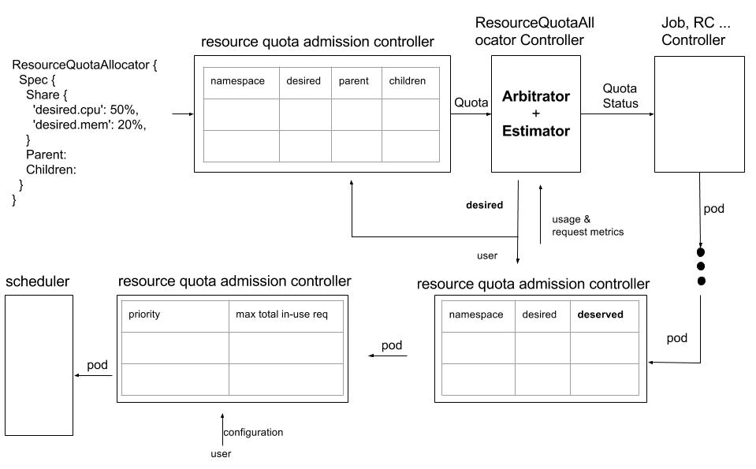

# kube-arbitrator

kube-arbitrator provides policy based resource sharing for a Kubernetes cluster. The following section describes the target scenario of this project:

As a cluster admin, I’d like to build an environment to run different workloads together, e.g. long running service, bigdata. As those applications are managed by different departments, I have to provide a resource guarantee to each applications, demonstrated as following:
    
1. Long running service (app area) and bigdata (bigdata area) can share resources:
    * Define resource usage of each area, e.g. 40% resources to app area, 60% to bigdata area.
    * Borrow/lending protocol: if the resources are idle in one area, they can be lent out and reclaimed through preemption
1. Run multiple clusters in bigdata area:
    * Define resource usage of each cluster within bigdata area, e.g. Spark, Hadoop
    * Share resources between those big data clusters, e.g. borrow/lending protocol

The detail of requirements for the "bigdata" are

* Run a set of applications
* Provide each application guaranteed access to some quantity of resources
* Provide all applications best-effort access to all unused resources according to some target weight (one weight assigned to each application, i.e. if all applications wanted to use all free resources, then they would be allowed to do so in some relative proportion)
* If some application A is using less than its guarantee, and then if it decides to use its guarantee and there aren't enough free resources to do so, it should be able to evict tasks from some other application or applications (that is/are using more than their guarantee) in order to obtain its guarantee

Further, group "bigdata" apps and "service" apps into two buckets, providing each bucket (in aggregate) guaranteed access to some fraction of the cluster, and best-effort access to the entire cluster with the understanding that usage above the guarantee can be revoked at any time.

## Architecture

## Community, discussion, contribution, and support

Learn how to engage with the Kubernetes community on the [community page](http://kubernetes.io/community/).

You can reach the maintainers of this project at:

- Slack: #kubernetes-dev
- Mailing List: https://groups.google.com/forum/#!forum/kubernetes-dev

## Kubernetes Incubator

This is a [Kubernetes Incubator project](https://github.com/kubernetes/community/blob/master/incubator.md). The project was established 2017-07-01. The incubator team for the project is:

- Sponsor: Joe Beda ([@jbeda](https://github.com/jbeda))
- Champion: Timothy St. Clair ([@timothysc](https://github.com/timothysc))
- SIG: sig-scheduling

## Roadmap

1. Enhance basic user case for quota (in upstream)
1. Support percentage by ResourceQuotaAllocator (vs. hard code)
1. Support dynamic ResourceQuotaAllocator:
    1. Resource allocation by policy (DRF by default)
    1. Support fair sharing on GPU
    1. Make policy pluggable
1. Support Hierarchical namespaces (or other “tenants”)
1. Support object quota as child Namespace Quota
1. Integrate with Spark on Kubernetes, and other frameworks, e.g. Tensorflow
1. Support resource estimation for ResourceQuota & ObjectQuota
1. Integrate with priority/preemption feature to revoke resource according to policy
1. Handle unbound Queue (persist in etcd, and external sort)

### Code of conduct

Participation in the Kubernetes community is governed by the [Kubernetes Code of Conduct](code-of-conduct.md).
