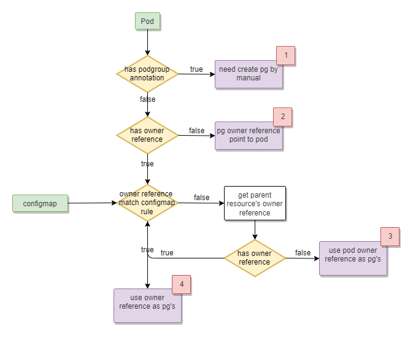

# Enhance Generate PodGroup OwnerReferences for Normal Pod

## Background
Volcano scheduler can schedule normal workload such as single Pod, Deployment, CronJob, Statefulset etc., and other CRD workflow. For these normal pod, volcano controller will create a podgroup for these workload. When it is a single Pod, controller will set the pod as podgroup's `ownerReferences`, otherwise controller will set pod's `ownerReferences` as the podgroup's `ownerReferences`. 

For issue [2143](https://github.com/volcano-sh/volcano/issues/2143) when deployment update, it will create new replicaset and volcano controller will create new podgroup for this replicaset. After several times update, the Deployment has many `Inqueue` podgroups. For example, it is not reasonable for one Deployment has four podgourps and three podgroups is in `Inqueue` status which will consume resources in `overcommit` plugin.

<table>
	<tr>
	    <th>Deployment</th>
	    <th>ReplicaSet</th>
	    <th>PodGroup</th>  
	</tr>
	<tr>
	    <td rowspan="4">deploy-with-volcano</td>
	    <td>deploy-with-volcano-7bd985746b</td>
	    <td>podgroup-4f5210d9-3cba-4a59-b61c-1b243f464708</td>
	</tr>
	<tr>
	    <td>deploy-with-volcano-7f95dd7984</td>
	    <td>podgroup-17fec14a-232c-4e1c-942e-e4d1289fc60b</td>
	</tr>
	<tr>
	    <td>deploy-with-volcano-fd9dd69b6</td>
	    <td>podgroup-5edaeb31-f16e-49c4-ac81-4aa331ea8f19</td>
	</tr>
	<tr>
	    <td>deploy-with-volcano-995f85c44</td>
	    <td>podgroup-0296521d-9dad-4d68-8abf-2d4b32f3bfbc</td>
	</tr>
</table>

## Solution
Some workload control pod directly such as Job, SparkApplication etc. For these workload, we can use the pod's `ownerReferences` as podgroup's `ownerReferences`. Some workload will control pod by other resources such as Deployment controls pod by Replicaset or Workflow controls pod by other resources.

Volcano controller will introduce a configmap which stores GVK(group/version/kind) array.

```
apiVersion: v1
kind: ConfigMap
metadata:
  name: volcano-controller-configmap
  namespace: volcano-system
data:
  volcano-controller.conf: |
    podgroupLevel:
    - apiversion: apps/v1                    
      kind: deployment
    - apiversion: batch/v1                    
      kind: job
    - apiversion: argoproj.io/v1alpha1                   
      kind: workflow
```

When controller need create a podgroup, it will check the pod `ownerReferences` apiversion and kind if match one of the configmap rule. If yes, will use this `ownerReferences` as podgroup's `ownerReferences`; if not, controller will use `dynamicClient` to check parent resource `ownerReferences` recursively until get the one match the configmap rule or the root `ownerReferences`.
 
 

## User Cases
Configmap:
```
apiVersion: v1
kind: ConfigMap
metadata:
  name: volcano-controller-configmap
  namespace: volcano-system
data:
  volcano-controller.conf: |
    podgroupLevel:
    - apiversion: apps/v1                    
      kind: deployment
    - apiversion: batch/v1                    
      kind: job
```
### 1. Single pod workload with scheduling.k8s.io/group-name annotation
Pod has scheduling.k8s.io/group-name annotation, controller will not create pg for it.

### 2. Single pod workload without scheduling.k8s.io/group-name annotation
Pod does not have owner reference, controller will create pg and set this pod as pg's owner reference.

### 3. Complex workflow
Consider argo workflow such as: 
```
apiVersion: argoproj.io/v1alpha1
kind: Workflow
metadata:
  generateName: k8s-jobs-
spec:
  entrypoint: pi-tmpl
  templates:
  - name: pi-tmpl
    resource:                  
      action: create           
      successCondition: status.succeeded > 0
      failureCondition: status.failed > 3
      manifest: |              
        apiVersion: batch/v1
        kind: Job
        metadata:
          generateName: pi-job-
        spec:
          template:
            metadata:
              name: pi
            spec:
              containers:
              - name: pi
                image: perl
                command: ["perl",  "-Mbignum=bpi", "-wle", "print bpi(2000)"]
              restartPolicy: Never
          backoffLimit: 4
```
Pod's owner reference points to a Job and Job's owner reference points to a Workflow. Because the configmap does not contain any information about workflow and job, finally controller will create a pg and use pod's owner reference (Job) information as pg's owner reference.

### 4. Deployment workload
Pod's owner reference points to a ReplicaSet and ReplicaSet's owner reference points to Deployment. Controller will search owner reference recursively, finally find the ReplicaSet's owner reference (Deployment) match one of the configmap rule. Controller will set this Deployment pg's owner reference.
