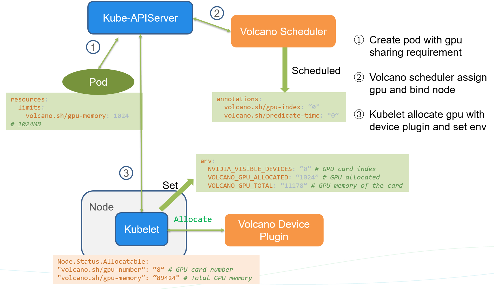

# GPU Sharing User guide

## Note: GPU Sharing will be deprecated in volcano v1.9, please use volcano vgpu instead

[Volcano vgpu](./how_to_use_vgpu.md)

## Environment setup

### Install volcano

#### 1. Install from source

Refer to [Install Guide](../../installer/README.md) to install volcano.

After installed, update the scheduler configuration:

```shell script
kubectl edit cm -n volcano-system volcano-scheduler-configmap
```

For volcano v1.8.2+(v1.8.2 included), use the following configMap 

```yaml
kind: ConfigMap
apiVersion: v1
metadata:
  name: volcano-scheduler-configmap
  namespace: volcano-system
data:
  volcano-scheduler.conf: |
    actions: "enqueue, allocate, backfill"
    tiers:
    - plugins:
      - name: priority
      - name: gang
      - name: conformance
    - plugins:
      - name: drf
      - name: devices
        arguments:
          devices.GPUSharingEnable: true # enable gpu sharing
      - name: predicates
      - name: proportion
      - name: nodeorder
      - name: binpack
```

For volcano v1.8.2-, use the following configMap 

```yaml
kind: ConfigMap
apiVersion: v1
metadata:
  name: volcano-scheduler-configmap
  namespace: volcano-system
data:
  volcano-scheduler.conf: |
    actions: "enqueue, allocate, backfill"
    tiers:
    - plugins:
      - name: priority
      - name: gang
      - name: conformance
    - plugins:
      - name: drf
      - name: predicates
        arguments:
          predicate.GPUSharingEnable: true # enable gpu sharing
      - name: proportion
      - name: nodeorder
      - name: binpack
```

#### 2. Install from release package

Same as above, after installed, update the scheduler configuration in `volcano-scheduler-configmap` configmap.

### Install Volcano device plugin

Please refer to [volcano device plugin](https://github.com/volcano-sh/devices/blob/master/README.md#quick-start)

* By default volcano device plugin supports shared GPUs, users do not need to config volcano device plugin. Default setting is the same as setting --gpu-strategy=share. For more information [volcano device plugin configuration](https://github.com/volcano-sh/devices/blob/master/doc/config.md)

### Verify environment is ready

Check the node status, it is ok if `volcano.sh/gpu-memory` and `volcano.sh/gpu-number` are included in the allocatable resources.

```shell script
$ kubectl get node {node name} -oyaml
...
status:
  addresses:
  - address: 172.17.0.3
    type: InternalIP
  - address: volcano-control-plane
    type: Hostname
  allocatable:
    cpu: "4"
    ephemeral-storage: 123722704Ki
    hugepages-1Gi: "0"
    hugepages-2Mi: "0"
    memory: 8174332Ki
    pods: "110"
    volcano.sh/gpu-memory: "89424"
    volcano.sh/gpu-number: "8"    # GPU resource
  capacity:
    cpu: "4"
    ephemeral-storage: 123722704Ki
    hugepages-1Gi: "0"
    hugepages-2Mi: "0"
    memory: 8174332Ki
    pods: "110"
    volcano.sh/gpu-memory: "89424"
    volcano.sh/gpu-number: "8"   # GPU resource
```

### Running GPU Sharing Jobs

NVIDIA GPUs can now be shared via container level resource requirements using the resource name `volcano.sh/gpu-memory`:

```shell script
$ cat <<EOF | kubectl apply -f -
apiVersion: v1
kind: Pod
metadata:
  name: gpu-pod1
spec:
  schedulerName: volcano
  containers:
    - name: cuda-container
      image: nvidia/cuda:9.0-devel
      command: ["sleep"]
      args: ["100000"]
      resources:
        limits:
          volcano.sh/gpu-memory: 1024 # requesting 1024MB GPU memory
EOF

$ cat <<EOF | kubectl apply -f -
apiVersion: v1
kind: Pod
metadata:
  name: gpu-pod2
spec:
  schedulerName: volcano
  containers:
    - name: cuda-container
      image: nvidia/cuda:9.0-devel
      command: ["sleep"]
      args: ["100000"]
      resources:
        limits:
          volcano.sh/gpu-memory: 1024 # requesting 1024MB GPU memory
EOF
```

If only the above pods are claiming gpu resource in a cluster, you can see the pods sharing one gpu card:

```shell script
$ kubectl exec -ti  gpu-pod1 env
...
VOLCANO_GPU_MEMORY_TOTAL=11178
VOLCANO_GPU_ALLOCATED=1024
NVIDIA_VISIBLE_DEVICES=0
...

$ kubectl exec -ti  gpu-pod1 env
...
VOLCANO_GPU_MEMORY_TOTAL=11178
VOLCANO_GPU_ALLOCATED=1024
NVIDIA_VISIBLE_DEVICES=0
...
```

### Understanding how GPU sharing works

The GPU sharing workflow is depicted as below:



1. create a pod with `volcano.sh/gpu-memory` resource request,

2. volcano scheduler predicates and allocate gpu resource for the pod. Adding the below annotation

```yaml
annotations:
  volcano.sh/gpu-index: "0"
  volcano.sh/predicate-time: "1593764466550835304"
```

3. kubelet watches the pod bound to itself, and call allocate API to set env before running the container.

```yaml
env:
  NVIDIA_VISIBLE_DEVICES: "0" # GPU card index
  VOLCANO_GPU_ALLOCATED: "1024" # GPU allocated
  VOLCANO_GPU_MEMORY_TOTAL: "11178" # GPU memory of the card
```
